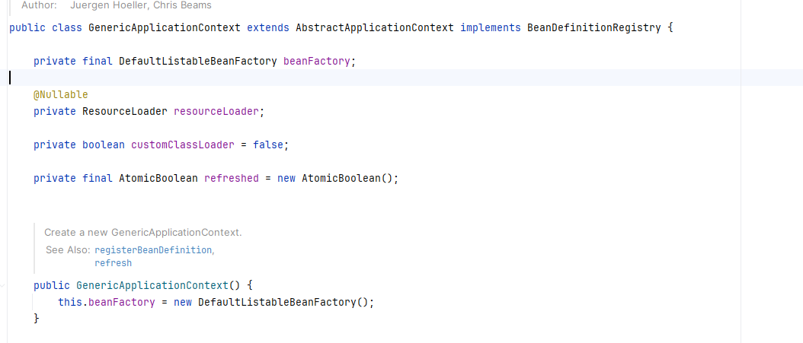
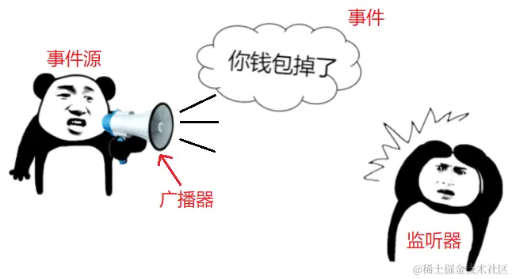

# 笔记

看的过程中做一些笔记

(1) 在spring框架中，以capable结尾的接口，通常意味着能通过其中某个特定方法得到特定组件

```java
public interface EnvironmentCapable {
	Environment getEnvironment();
}
```


(2) genericApplicationContext 中组合了 DefaultListableBeanFactory，由此可以得到一个非常重要的信息：applicationContext 并不是继承了 BeanFactory 容器，而是组合了 BeanFactory.




(3) AbstractRefreshableApplicationContext 支持多次被刷新，refresh方法多次被调用。


(4) spring 框架中，体现观察者模式的特性就是事件驱动和监听器。

监听器充当订阅者，监听特定的事件。

事件源充当被观察的主题，用来发布事件。

ioc 容器本身也是事件广播器，也可以理解成观察者。

事件源：发布事件的对象。



(5) 模块装配 

@Import

(6) 条件装配

@Profile (控制整个项目运行环境)


@Conditional (决定单个bean是否需要被装配)

| 注解 | 使用方式 | 含义 |
| --- | --- | --- |
| `@Conditional` | ``` @Conditional(CustomCondition.class) public class MyClass { ... } ``` | 这是一个基础注解，需要传入实现了`Condition`接口的类，根据该类`matches`方法的返回值决定是否创建Bean或加载配置类 |
| `@ConditionalOnProperty` | ``` @ConditionalOnProperty(name = "my.property", havingValue = "true") public class MyClass { ... } ``` | 当配置文件中指定属性（如`my.property`）的值与`havingValue`指定的值相同时，才会创建对应的Bean或加载配置类 |
| `@ConditionalOnClass` | ``` @ConditionalOnClass(name = "com.example.SomeClass") public class MyClass { ... } ``` | 当类路径下存在指定的类（如`com.example.SomeClass`）时，才会创建对应的Bean或加载配置类 |
| `@ConditionalOnMissingClass` | ``` @ConditionalOnMissingClass("com.example.SomeClass") public class MyClass { ... } ``` | 当类路径下不存在指定的类（如`com.example.SomeClass`）时，才会创建对应的Bean或加载配置类 |
| `@ConditionalOnBean` | ``` @ConditionalOnBean(AnotherBean.class) public class MyClass { ... } ``` | 当Spring容器中已经存在指定类型的Bean（如`AnotherBean`）时，才会创建对应的Bean或加载配置类 |
| `@ConditionalOnMissingBean` | ``` @ConditionalOnMissingBean(AnotherBean.class) public class MyClass { ... } ``` | 当Spring容器中不存在指定类型的Bean（如`AnotherBean`）时，才会创建对应的Bean或加载配置类 |
| `@ConditionalOnWebApplication` | ``` @ConditionalOnWebApplication public class MyClass { ... } ``` | 当应用是Web应用时，才会创建对应的Bean或加载配置类 |
| `@ConditionalOnNotWebApplication` | ``` @ConditionalOnNotWebApplication public class MyClass { ... } ``` | 当应用不是Web应用时，才会创建对应的Bean或加载配置类 | 

(7) 元信息

类的名字，类的方法，类的属性，类的全限定名等叫做元信息。

(8) 通过注解@Component 或者 @Service 之类生成bean，beanname都是类型首字母小写的

因为@ComponentScan中有个 nameGenerator 的属性类，有个实现的子类：AnnotationBeanNameGenerator
总之后面又用到了java的内省类：Introspector


